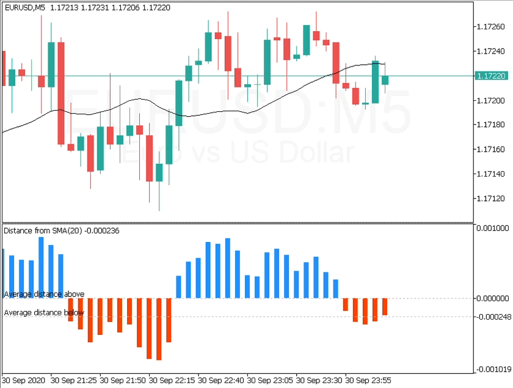
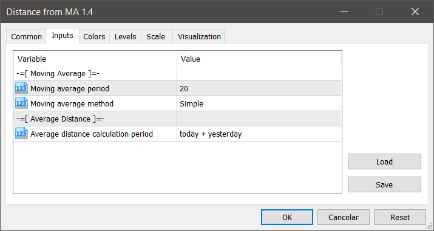
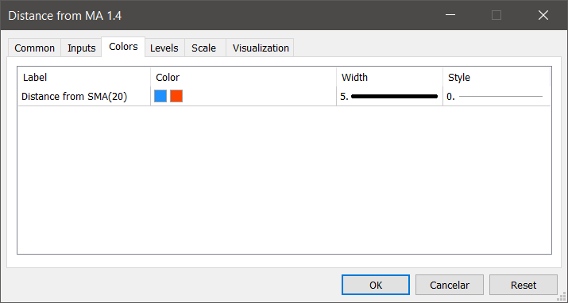
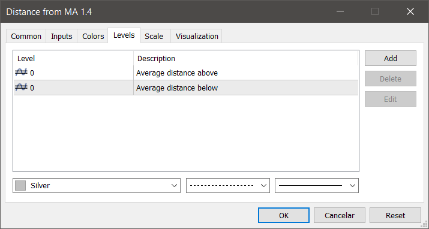

## MetaTrader 5 > Indicator > Distance from Moving Average

### Description

This indicator measures the largest distance between a price (high or low) and a moving average. It may come in handy for strategies that open reverse positions as price moves away from a moving average within a certain range, awaiting it to return so the position can be closed.

It just works on any symbol and timeframe.

### Settings

#### Inputs

- **Moving average period**: Period for moving average calculation.
- **Moving average method**: You can choose between "Simple", "Exponential", "Smoothed" and "Linear-weighted" moving average methods.
- **Average distance calculation period**: This is the calculation period for the average distance, and the options are "today", "today + yesterday", "today + past 2 days", "today + past 3 days", "today + past 4 days", "today + past 5 days" and "today + past 6 days".

#### Colors

- Histogram color, width and style.

#### Levels

- Level lines color, style and thickness.

----

### Instructions

1. Copy this project folder to your **MetaEditor** indicator folder.
2. Select the *.mq5* file and click *'Compile'* button on **MetaEditor**.
3. On **MetaTrader**, insert this compiled indicator into the chart you want.

----

### References

- [MQL5 Documentation](https://www.mql5.com/en/docs)

### MQL5 Market

- [My MQL5 Published Products](https://www.mql5.com/en/users/leonardo_splinter/seller)
